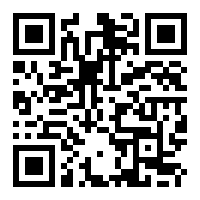

## Get Application
Version: 0.3

GH-Pages site: https://alpiepho.github.io/scoreboard_tn/

or QR Code:

## "Install" on iPhone

This application is a Web application known as a PWA (progressive web application).  It is possible to add a PWA to the home screen of an iPhone
like it is a downloaded application (there is a similare mechanism for Android that is not discused here).  Use the following steps:

1. Open the above link in Safari and click on up-arrow

2. Click on "Add to Home Screen"

3. Select "Add"

### Known Issue

A PWA on iPhone requires internet access to launch the first time.  However, once it is running, the application will work fine without and
internet connection.

## About
My flutter version of a Scoreboard application.

This application was built to better learn Flutter and Dart.  The world really doesn't need another simple scoring application, but attempting to duplicate how several of these common applications work, provided a way to learn many things:

- Flutter itself
- Flutter web applications as a PWA
- Learn about some of it's short commings with respect to a Google Lighthouse score
- Arranging cards
- Gesture detection and processing
- Modal dialogs
- Color Pickers
- Google fonts within Flutter
- Persistent Data
- Several other areas

These are all areas that I hope to take forward into other applications.  Flutter is fun.

## Basic Usages

The application from the above URL will open a respoonsive web page.  It is best viewed on a mobile phone with the most testing on and iPhoneX.  If opened on iPhone Safari, you can used the middle bottom button to add to the Home Screen (as a PWA).

The application opens with two large colored buttons for two teams.  Tapping either will icrement their score.  Swiping up will increment the score.  Swiping down will decrement with a limit at 0.  The Gear button will open a settings dialog.

The settings dialog allows some quick actions from icons at the top: clear scores, swap teams, and a done checkmark to save settings listed below.  All saved settings are added to the persistent storage so the next launch will read them and the user can pick up where they left off.

Other settings allow changing the team names, adjusting scores, and picking colors for the team text and background.

At the bottom are a number of predefined fonts.  These are like the top icons, and will immediately be saved.

Below are some lists of things yet to do and possible future changes.

Thanks for trying out this applications.

## Earned Points
Have you ever wanted to track the points each team really "earned", instead of what they scored?  The setting "Track earned points"
will let you do that.  This will enable second tally shown below the main score.  If you tap on that label, the score for earned
and the total points will be incremented.  These values also are shown in the Recording clipboard.

Since "earned" points correlates with "errors", and some parents get worked up about "errors", you can track the earned points and
while disabling showing the values.

NOTE: The swipe down, or delete a point, feature will currently decrement BOTH total and earned.  This may change in the future
if an intuitive gesture can be found.

## Todo and Future Changes
- refactor long files
- More fonts
- Fix more Lighthouse issues (might be in Flutter)

## Reference

Icons created with https://appicon.co/  NOTE: original image should be square to avoid white edges on IOS Home screen.

